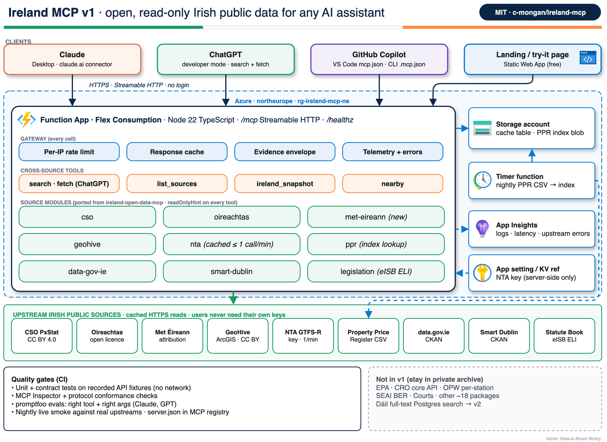

# Ireland MCP

[](https://github.com/c-mongan/ireland-mcp/actions/workflows/ci.yml)
[](LICENSE)

**TL;DR:** one free, read-only [Model Context Protocol](https://modelcontextprotocol.io)
server that lets Claude, ChatGPT, GitHub Copilot and other AI assistants look up
Irish public data. Ask "What's the population of Galway?", "Any weather warnings
today?" or "What did houses sell for in Ennis last year?" and the assistant gets
real figures, with the source, licence and retrieval time attached.

- **14 sources, 41 tools.** CSO, Oireachtas, GeoHive, data.gov.ie, Smart Dublin,
  Met Éireann, NTA, the Irish Statute Book, the Property Price Register, Irish Rail,
  Luas, EirGrid, Marine Institute weather buoys and OPW river levels.
- **Two ways to run it.** A hosted Streamable HTTP endpoint (`/mcp`), or locally
  over stdio with `npx -y ireland-mcp`.
- **No accounts.** Nothing to sign up for. Nothing is written anywhere.



> **Hosted endpoint:** `https://func-ireland-mcp-aofsjpwgy4hva.azurewebsites.net/mcp`
> (Streamable HTTP, no key needed). The npm package is not published yet; until it is,
> run the stdio server from source (see [Run from source](#run-from-source)).

## Tool surface: lean by default

By default `tools/list` is small: **7 tools, about 5,100 chars (≈1.3k tokens)**,
down from 41 typed tools at about 35,700 chars (≈8.9k tokens). That keeps clients
such as Cursor well under their ~40-tool limit and saves context. A CI test fails
if the default list grows past 16,000 chars (≈4k tokens); `npm run measure:tools`
prints the current figure.

| Tool | Purpose |
| --- | --- |
| `ireland_catalogue(domain?)` | Sources grouped by domain (stats, transport, environment, energy, law/politics, places/property), each with its operations |
| `ireland_describe(source, operation)` | The operation's JSON schema, description and a working example |
| `ireland_call(source, operation, args, max_tokens?)` | Validates `args` server-side and runs the operation. Bad args return the schema and an example |
| `ireland_about` | Licence, attribution, status URL, and how to enable typed toolsets |
| `search`, `fetch` | Cross-source search and fetch (ChatGPT deep research contract) |
| `nearby` | Kept top level because it is small (<300 tokens) |

Every typed tool below is an **operation** of its source, with the same name, so
`ireland_call {source: "irish-rail", operation: "rail_get_departures", args: {station: "Heuston"}}`
does the same thing as calling `rail_get_departures` directly.

**Typed toolsets on demand.** Add a source's typed tools to `tools/list` when a
client works better with them:

| Where | How |
| --- | --- |
| HTTP query | `/mcp?toolsets=cso,irish-rail` (comma list of source ids) |
| HTTP path | `/mcp/x/irish-rail` (one source) |
| Everything | `/mcp?toolsets=all` (all 41 typed tools plus the meta tools, ≈10.8k tokens) |
| stdio | `npx -y ireland-mcp --toolsets=cso,irish-rail`, or `IRELAND_MCP_TOOLSETS=all` |

Source ids: `cso`, `oireachtas`, `geohive`, `data-gov-ie`, `smart-dublin`,
`met-eireann`, `nta`, `legislation`, `ppr`, `irish-rail`, `luas`, `eirgrid`,
`marine`, `opw-water`, `cross`. An unknown id is a clear error (HTTP 400 with the
valid list, or exit code 1 on stdio).

**Response budget.** Each result is capped at about 2,000 tokens (chars ÷ 4).
Pass `max_tokens` (100–8,000) to change it. When a large list is cut, the result
carries `truncated: true`, `returned`, `total` and a hint to narrow the request.
Results also come back as `structuredContent`.

**Resources and prompts.** Each source is a resource, `ireland://sources/{id}`
(licence, attribution, coverage, operations). Three prompts are included:
`area_profile(place)`, `commute_check(station)` and `compare_counties(metric, counties)`.

## Tools

| Source | Tools | Data |
| --- | --- | --- |
| CSO PxStat | `cso_search_tables`, `cso_get_table_metadata`, `cso_get_data`, `cso_area_profile` | National statistics: census, prices, labour, housing |
| Oireachtas | `oireachtas_search_members`, `oireachtas_search_bills`, `oireachtas_get_debates`, `oireachtas_search_questions`, `oireachtas_get_votes` | TDs and Senators, bills, debates, PQs, divisions |
| GeoHive | `geohive_boundaries_at_point`, `geohive_list_layers`, `geohive_query_layer` | County, constituency, LEA, electoral division, small area |
| data.gov.ie | `datagov_search_datasets`, `datagov_get_dataset`, `datagov_query_datastore` | National open data catalogue |
| Smart Dublin | `smartdublin_search_datasets`, `smartdublin_get_dataset`, `smartdublin_query_datastore` | Dublin local authority datasets |
| Met Éireann | `met_get_forecast`, `met_get_observations`, `met_get_warnings` | Point forecasts, station observations, warnings |
| NTA | `nta_get_realtime_summary`, `nta_get_trip_updates` | Live GTFS-R delays and cancellations (operator key) |
| Irish Statute Book | `legislation_list_acts`, `legislation_get_act`, `legislation_get_section` | Acts by year, Act and section text via ELI |
| Property Price Register | `ppr_search_sales`, `ppr_price_stats` | Residential sales since 2010, area statistics |
| Irish Rail | `rail_find_station`, `rail_get_departures` | Live train departures for every station |
| Luas (TII) | `luas_get_forecast`, `luas_list_stops` | Live tram arrivals, stop list, service messages |
| EirGrid | `grid_get_status` | Live demand, wind generation and carbon intensity |
| Marine Institute | `marine_get_buoys` | Offshore wind, waves, air and sea temperature |
| OPW (waterlevel.ie) | `water_find_stations`, `water_get_level` | River and lake levels at ~460 gauges, last 36 hours |
| Cross-source | `search`, `fetch`, `list_sources`, `ireland_snapshot`, `nearby` | Search everything, fetch by id, place summaries |

All of these are reachable on the default surface through `ireland_call`; they
are listed as tools only when their toolset is enabled (see above).

`search` and `fetch` follow the ChatGPT deep research contract. `search` returns
`[{id, title, url}]` with ids such as `cso:FY003A`, `oireachtas:bill/2024/12` or
`legislation:2024/1`; `fetch(id)` returns `{id, title, text, url, metadata}`.

Every other tool returns an **evidence envelope**:

```json
{
  "data": { "...": "..." },
  "source": "Met Éireann",
  "url": "https://www.met.ie/Open_Data/json/warning_IRELAND.json",
  "licence": "CC BY 4.0",
  "attribution": "Copyright Met Éireann. Source: www.met.ie. ...",
  "retrieved_at": "2026-10-05T12:00:00.000Z",
  "cached": false,
  "truncated": false
}
```

`stale: true` means the source was down and you are seeing the last good copy.
Failures are typed: `BAD_ARGS`, `NOT_FOUND`, `UPSTREAM_DOWN`, `RATE_LIMITED`,
each with a hint the model can act on. Lists default to 50 items, max 500.

## Connect a client

The hosted URL is `https://func-ireland-mcp-aofsjpwgy4hva.azurewebsites.net/mcp`.
If you deploy your own copy, use your own function app URL instead.

Any URL below can take `?toolsets=...` or the `/mcp/x/{source}` form, for example
`https://func-ireland-mcp-aofsjpwgy4hva.azurewebsites.net/mcp?toolsets=irish-rail,luas`.
For stdio, add `"--toolsets=cso"` to `args`.

### Claude Desktop (local, stdio)

`claude_desktop_config.json`:

```json
{
  "mcpServers": {
    "ireland": { "command": "npx", "args": ["-y", "ireland-mcp"] }
  }
}
```

### Claude (remote connector)

Settings → Connectors → **Add custom connector**, then paste the hosted `/mcp`
URL. No authentication is needed.

### ChatGPT (developer mode)

Settings → Apps & Connectors → Advanced settings → turn on **Developer mode**.
Create a connector with the hosted `/mcp` URL and **No authentication**. Deep
research uses `search` and `fetch`; chat can use every tool. Developer mode
availability depends on your plan and region — check it is offered in Ireland
and the EEA for your account before relying on it.

### VS Code

`.vscode/mcp.json` (the top-level key is `servers`):

```json
{
  "servers": {
    "ireland": { "type": "http", "url": "https://func-ireland-mcp-aofsjpwgy4hva.azurewebsites.net/mcp" }
  }
}
```

Local alternative: `{ "type": "stdio", "command": "npx", "args": ["-y", "ireland-mcp"] }`.

### GitHub Copilot CLI

`.mcp.json` in a repo, or `~/.copilot/mcp-config.json` (the top-level key is `mcpServers`):

```json
{
  "mcpServers": {
    "ireland": { "type": "http", "url": "https://func-ireland-mcp-aofsjpwgy4hva.azurewebsites.net/mcp", "tools": ["*"] }
  }
}
```

### Environment variables (local stdio)

| Variable | Needed for | Default |
| --- | --- | --- |
| `NTA_API_KEY` | `nta_*` tools. Free key from [developer.nationaltransport.ie](https://developer.nationaltransport.ie) | unset: NTA tools return a clear error |
| `PPR_INDEX_PATH` | Faster PPR lookups from a prebuilt index (`npm run ppr:build`) | `.ppr-cache/index-v1.json.gz`; falls back to live county CSVs |
| `IRELAND_MCP_TELEMETRY` | Set to `off` to silence the one-line JSON tool logs on stderr | on |
| `IRELAND_MCP_TOOLSETS` | Typed toolsets to list, e.g. `cso,irish-rail` or `all` (same as `--toolsets=`) | unset: meta tools only |

The hosted app also reads `RATE_LIMIT_PER_MINUTE` (default 60 per IP),
`AzureWebJobsStorage__accountName`, `CACHE_TABLE_NAME` and `PPR_CONTAINER`, plus:

| Variable | Purpose | Default |
| --- | --- | --- |
| `MCP_ALLOWED_ORIGINS` | Comma-separated `Origin` allowlist for `/mcp`; other browser origins get 403. Requests without `Origin` are allowed. `*` matches one host label or any port; a leading `+` extends the default list; `*` alone allows all | claude.ai, chatgpt.com, `vscode-webview://*`, localhost, 127.0.0.1, the landing page SWA, irishopendata.ie, www.irishopendata.ie |
| `UPSTREAM_CONCURRENCY` / `UPSTREAM_MAX_QUEUE` | Concurrent calls per source, and how many may wait before `UPSTREAM_DOWN` | 8 / 32 |
| `UPSTREAM_TIMEOUT_MS` | Per-call upstream timeout | 10000 |
| `UPSTREAM_BREAKER_FAILURES` / `UPSTREAM_BREAKER_COOLDOWN_SECONDS` | Circuit breaker opens after N consecutive failures for M seconds; while open, calls return `UPSTREAM_DOWN` with `retryAfterSeconds`, or stale cache if any | 5 / 30 |
| `APPLICATIONINSIGHTS_CONNECTION_STRING` | Enables OpenTelemetry export through the Azure Monitor distro | unset: no-op |
| `IRELAND_MCP_OTEL` / `IRELAND_MCP_OTEL_SAMPLING_RATIO` / `OTEL_SERVICE_NAME` | `off` disables export; trace sampling ratio; service name | on / 1 / `ireland-mcp` |

Telemetry follows the OpenTelemetry MCP semantic conventions (spans named
`tools/call <tool>`, metric `mcp.server.operation.duration`) and records no argument
values or IPs. See [PRIVACY.md](PRIVACY.md).

### Health and status

- `GET /healthz` — fast liveness, no upstream calls.
- `GET /healthz?deep=1` — one cheap real call per source in parallel (5 s timeout), with
  per-source status, latency and circuit-breaker state. Cached for 60 s.
- Every 30 minutes a GitHub Action publishes the deep report to
  [`status/status.json`](https://raw.githubusercontent.com/c-mongan/ireland-mcp/status/status/status.json)
  and a 7-day [`status/history.json`](https://raw.githubusercontent.com/c-mongan/ireland-mcp/status/status/history.json)
  on the `status` branch.

## Skills & plugins

This repo is also a plugin and plugin marketplace: it bundles the hosted MCP server with nine
[Agent Skills](skills/) (area report, house prices, TD briefing, commute and weather, grid, flood watch,
CSO charts, legislation, open-data finder).

- Claude Code: `/plugin marketplace add c-mongan/ireland-mcp` then `/plugin install ireland-mcp@ireland-mcp`
- Copilot CLI: `copilot plugin install c-mongan/ireland-mcp`
- VS Code Agent Plugins and claude.ai skill zips (`npm run skills:package`): see [docs/plugins.md](docs/plugins.md)

## Run from source

Needs Node 22.12 or later.

```bash
git clone https://github.com/c-mongan/ireland-mcp && cd ireland-mcp
npm install && npm run build
node dist/src/cli.js          # stdio server — point a client's "command" here
npm run dev:http              # http://localhost:7071 landing page, MCP at /mcp
npx @modelcontextprotocol/inspector node dist/src/cli.js   # browse the tools
```

## Development

| Command | What it does |
| --- | --- |
| `npm test` | Unit tests against recorded fixtures — no network |
| `npm run test:coverage` | Same, with a coverage report |
| `npm run typecheck && npm run lint` | TypeScript and ESLint |
| `npm run inspector:check` | MCP conformance through the Inspector CLI (also in CI) |
| `npm run live:sanity` | One real call per source through `ireland_call`; `EVAL_TOOLSETS=all` calls the typed tools instead. Results in [docs/live-sanity.md](docs/live-sanity.md) |
| `npm run eval` | 40 Irish questions through promptfoo. Uses `OPENAI_API_KEY`, or Azure OpenAI with `AZURE_API_KEY`, `AZURE_API_HOST` and `AZURE_DEPLOYMENT`; skips without a key. Runs on the default surface; `EVAL_TOOLSETS=all` runs on the full one. A call via `ireland_call` with `operation: X` counts as calling `X` |
| `npm run measure:tools [-- all]` | Size of `tools/list` in chars and estimated tokens (after `npm run build`) |
| `npm run ppr:build` | Build the Property Price Register index locally |

CI runs lint, typecheck, tests, Inspector conformance and CodeQL. A nightly
workflow runs the live smoke test and opens an issue if a source breaks.

To add a source, see [CONTRIBUTING.md](CONTRIBUTING.md).

## Hosting

The hosted endpoint runs on Azure Functions Flex Consumption in North Europe,
with a capped instance count, a Table Storage cache, and App Insights. The
landing page in `web/` deploys to a free Azure Static Web App. See
[docs/deploy.md](docs/deploy.md).

## Licence and data

Code: [MIT](LICENSE). Data stays under each publisher's licence — mostly
CC BY 4.0. Keep the `attribution` text from each response when you reuse data.
Per-source details and credits are in [NOTICE](NOTICE). Not affiliated with any
Irish government body. Security reports: [SECURITY.md](SECURITY.md).
