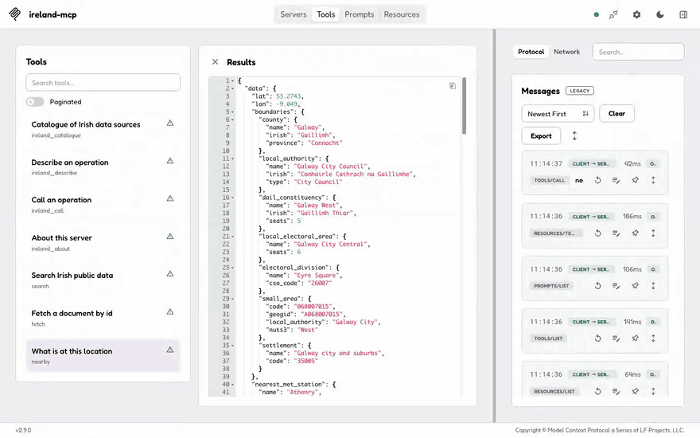
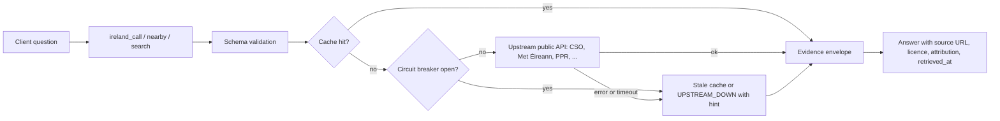
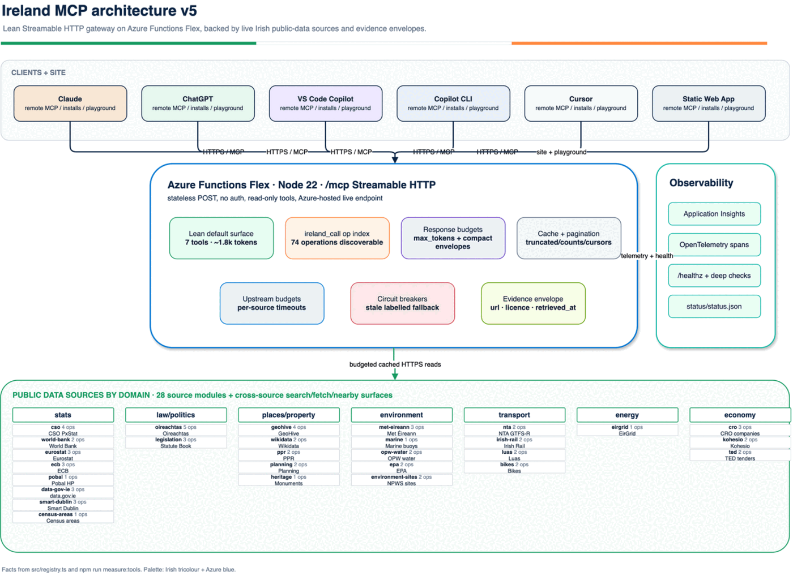
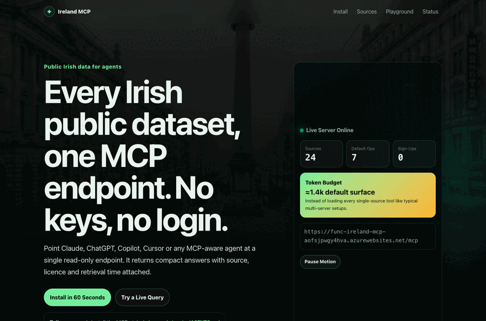
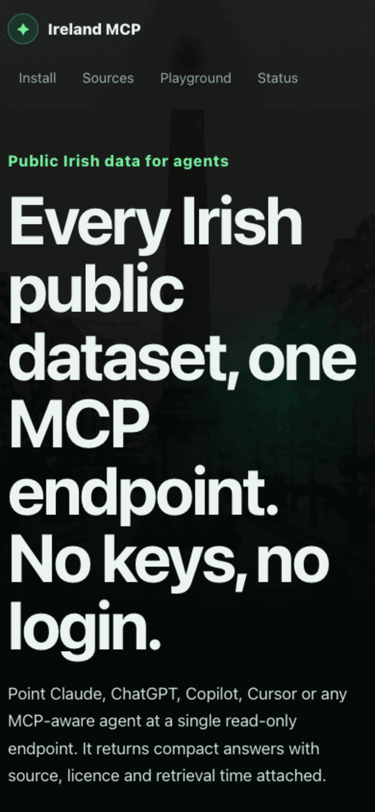
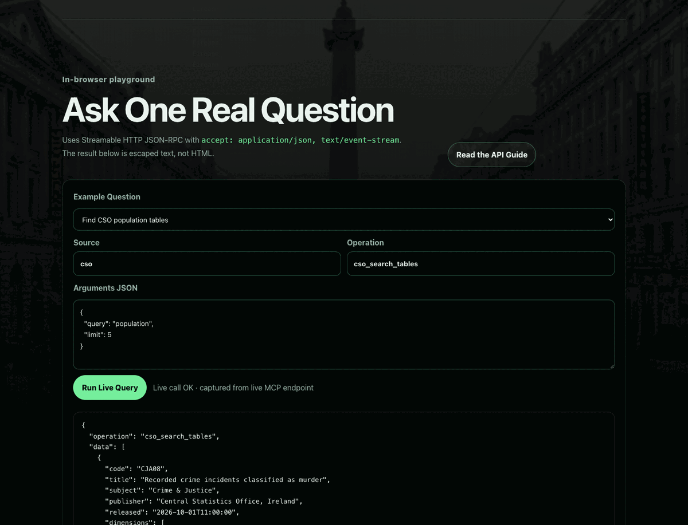
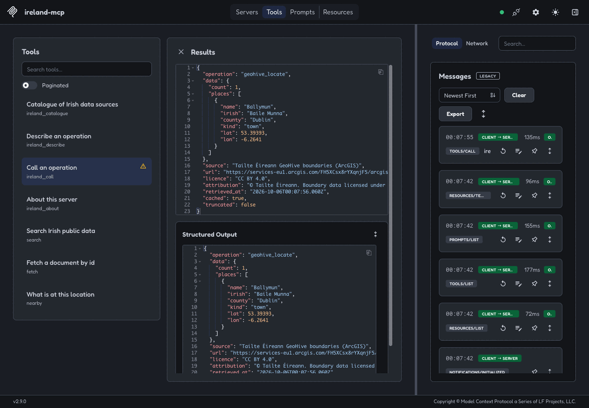
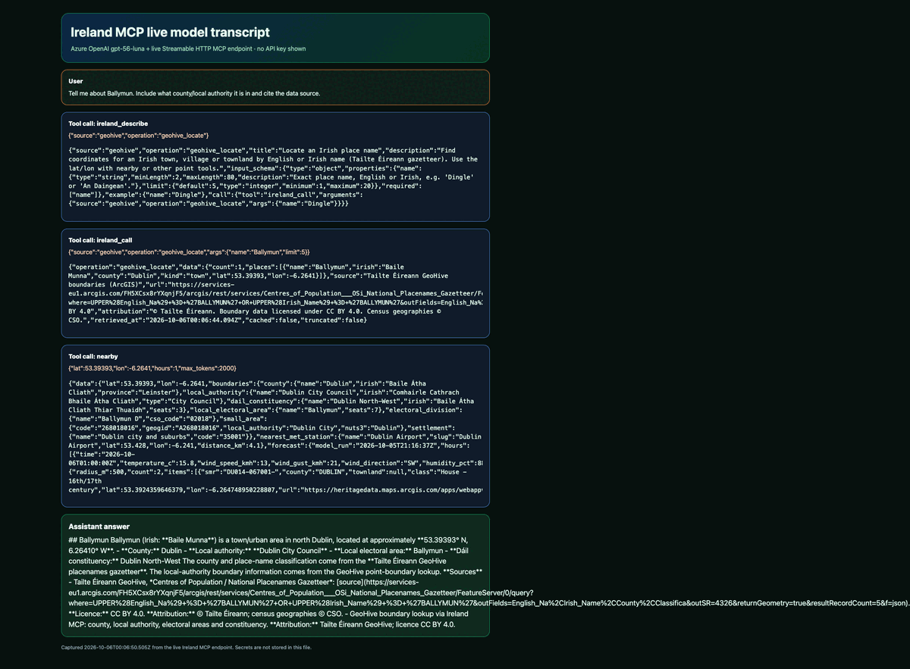
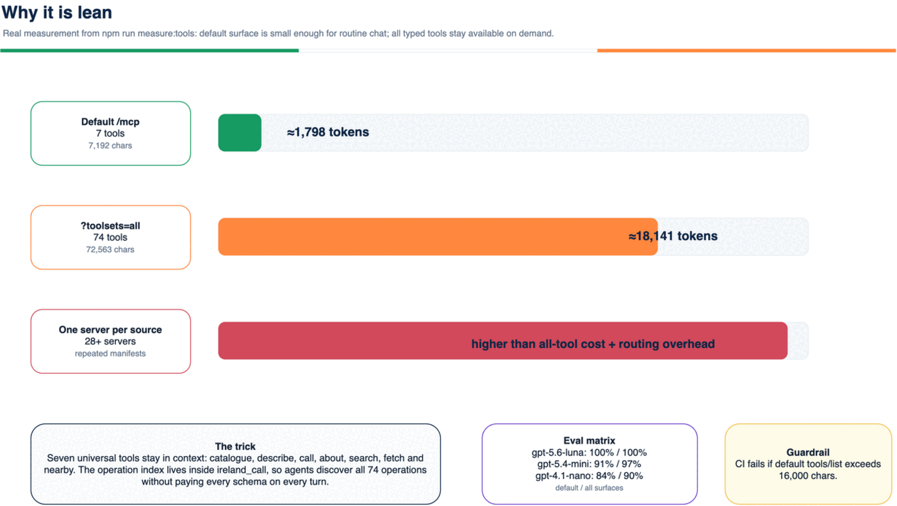
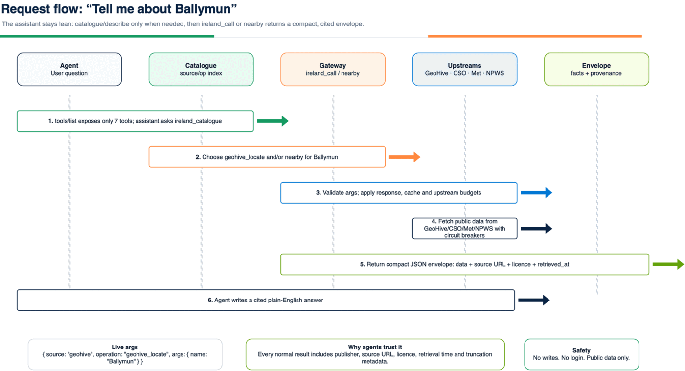

# Ireland MCP

[](https://github.com/c-mongan/ireland-mcp/actions/workflows/ci.yml)
[](LICENSE)
[](https://modelcontextprotocol.io)
[](#why-its-lean)

**Ireland MCP is a free, read-only MCP server that lets AI assistants answer questions with live Irish public data and citations.**

Hosted endpoint: `https://func-ireland-mcp-aofsjpwgy4hva.azurewebsites.net/mcp`
Transport: Streamable HTTP. Auth: none. Writes: none.
Website: <https://lemon-meadow-03b2b8903.3.azurestaticapps.net> (the planned `irishopendata.ie` domain is not live yet; see [docs/domain-go-live.md](docs/domain-go-live.md)).
Registry: [`io.github.c-mongan/ireland-mcp`](https://registry.modelcontextprotocol.io/v0.1/servers/io.github.c-mongan%2Fireland-mcp/versions/latest) on the official MCP Registry.
Hosted coverage: **26 of 28 sources work on the hosted endpoint.** Kohesio blocks Azure IP addresses (HTTP 403), so run it locally over stdio. NTA realtime needs an operator key that the hosted service does not have.

## Try it in 60 seconds

1. Add the server to your client. For GitHub Copilot CLI:
   `copilot mcp add --transport http ireland https://func-ireland-mcp-aofsjpwgy4hva.azurewebsites.net/mcp`
   For VS Code, add `.vscode/mcp.json`: `{ "servers": { "ireland": { "type": "http", "url": "https://func-ireland-mcp-aofsjpwgy4hva.azurewebsites.net/mcp" } } }`.
2. Ask: *"Using the ireland MCP tools, give me the Census 2022 profile of Ennis, Co Clare, and the Met Éireann forecast for Galway. Cite the sources."*
3. Check the answer cites `https://data.cso.ie/table/F1015` and the Met Éireann location-forecast URL. The forecast URL is `http://`; Met Éireann's `https://` host currently redirects to an origin that fails TLS.

<p align="center">
  
</p>

| Client (tested 7 Oct 2026 against the hosted endpoint) | Result |
| --- | --- |
| MCP Inspector (Playwright, [`scripts/demo-inspector.mjs`](scripts/demo-inspector.mjs)) | 4/4 calls (`nearby`, CSO, Met Éireann, PPR) returned data with citations. [CSO Ennis](docs/demo/inspector-cso-ennis.png), [PPR Galway 2024](docs/demo/inspector-ppr-galway-2024.png). |
| VS Code Insiders, Copilot agent mode | Census 2022 Ennis (27,923 people) and Galway forecast, with CSO and Met Éireann citations. [Screenshot](docs/demo/vscode-copilot-chat.png). |
| GitHub Copilot CLI | 3/3 questions answered with citations: Met Éireann Galway, PPR Cork, CSO Ennis. [Evidence](docs/demo/README.md). |
| Every catalogue operation | [docs/live-all-ops.md](docs/live-all-ops.md): 64 pass, 0 fail. Kohesio is blocked from Azure IPs; NTA needs a key. |

How a call flows:



<p align="center">
  <a href="docs/architecture/ireland-mcp-arch-v5.drawio">
    
  </a>
</p>

## Try asking

- “What is the latest population profile for Galway city or County Cork?”
- “Are there Met Éireann weather warnings near Dublin today?”
- “What did houses sell for in Ennis last year?”
- “When is the next train from Heuston, and are there disruptions?”
- “Who are the current TDs for my constituency, and what bills are active?”
- “What protected habitats, monuments, planning applications or census areas are near this point?”

## See it work

| Proof | Screenshot |
| --- | --- |
| Live landing page, desktop |  |
| Live landing page, mobile |  |
| Install section with one-click client setup |  |
| Playground populated from a real live MCP call |  |
| MCP Inspector connected to the live endpoint |  |
| Real model transcript: question → tool calls → answer |  |

## Install

| Client | Current setup |
| --- | --- |
| Claude custom connector | Settings → Connectors → **Add custom connector** → URL `https://func-ireland-mcp-aofsjpwgy4hva.azurewebsites.net/mcp` → no auth. |
| ChatGPT developer mode connector | Settings → Apps & Connectors → Advanced settings → enable **Developer mode** → create MCP connector → URL above → no auth. The remote endpoint supports Streamable HTTP; `search`/`fetch` are included for deep-research style clients. |
| VS Code | Deeplink: [`vscode://mcp/install?...`](vscode://mcp/install?%7B%22ireland%22%3A%7B%22type%22%3A%22http%22%2C%22url%22%3A%22https%3A%2F%2Ffunc-ireland-mcp-aofsjpwgy4hva.azurewebsites.net%2Fmcp%22%7D%7D). Or add `.vscode/mcp.json`: `{ "servers": { "ireland": { "type": "http", "url": "https://func-ireland-mcp-aofsjpwgy4hva.azurewebsites.net/mcp" } } }`. |
| VS Code Insiders | Deeplink: [`vscode-insiders://mcp/install?...`](vscode-insiders://mcp/install?%7B%22ireland%22%3A%7B%22type%22%3A%22http%22%2C%22url%22%3A%22https%3A%2F%2Ffunc-ireland-mcp-aofsjpwgy4hva.azurewebsites.net%2Fmcp%22%7D%7D). |
| Cursor | Deeplink: [`cursor://anysphere.cursor-deeplink/mcp/install?name=ireland&config=...`](cursor://anysphere.cursor-deeplink/mcp/install?name=ireland&config=eyJ0eXBlIjoiaHR0cCIsInVybCI6Imh0dHBzOi8vZnVuYy1pcmVsYW5kLW1jcC1hb2ZzanB3Z3k0aHZhLmF6dXJld2Vic2l0ZXMubmV0L21jcCJ9). Decoded config: `{ "type": "http", "url": "https://func-ireland-mcp-aofsjpwgy4hva.azurewebsites.net/mcp" }`. |
| GitHub Copilot CLI | `copilot mcp add --transport http ireland https://func-ireland-mcp-aofsjpwgy4hva.azurewebsites.net/mcp` or put the JSON below in `~/.copilot/mcp-config.json`. |
| Claude Code | `claude mcp add --transport http ireland https://func-ireland-mcp-aofsjpwgy4hva.azurewebsites.net/mcp` |
| Local stdio | npm package target: `npx -y ireland-mcp` after npm publication. Today, run from source: `npm ci && npm run build && node dist/src/cli.js`. To list typed tools locally, run `node dist/src/cli.js --toolsets=cso,irish-rail` or `IRELAND_MCP_TOOLSETS=all node dist/src/cli.js` after building. |

Portable Copilot / MCP JSON:

```json
{
  "mcpServers": {
    "ireland": {
      "type": "http",
      "url": "https://func-ireland-mcp-aofsjpwgy4hva.azurewebsites.net/mcp",
      "tools": ["*"]
    }
  }
}
```

## Why it is lean

Most data MCPs expose every typed tool up front. Ireland MCP keeps the default `tools/list` to **7 tools, 7,192 characters, about 1,798 tokens** on this branch (`npm run measure:tools`). CI fails if that list grows past 16,000 characters.

<p align="center">
  <a href="docs/architecture/ireland-mcp-lean-surface.drawio">
    
  </a>
</p>

Need typed tools anyway?

| Surface | Use |
| --- | --- |
| Default HTTP | `/mcp` lists only `ireland_catalogue`, `ireland_describe`, `ireland_call`, `ireland_about`, `search`, `fetch`, `nearby`. |
| Source toolsets | `/mcp?toolsets=cso,irish-rail` lists selected typed tools too. |
| One source path | `/mcp/x/{source}` lists that source's typed tools, for example `/mcp/x/met-eireann`. |
| Everything | `/mcp?toolsets=all` lists all 74 tools and is useful for debugging, not routine chat. |
| Local stdio | From source: `node dist/src/cli.js --toolsets=cso` or `IRELAND_MCP_TOOLSETS=all node dist/src/cli.js` (npm package not yet published). |

`max_tokens` defaults to about 2,000 output tokens and can be set from 100 to 8,000. Large results return `truncated`, counts and narrowing hints instead of flooding the context.

## Architecture

The server is a stateless Azure Functions Flex app with a lean gateway in front of the source modules. The gateway owns the operation index, response budgets, cache, upstream budgets, circuit breakers and evidence envelope; every normal result includes source URL, licence, attribution and retrieval metadata.

| Diagram | Editable source |
| --- | --- |
|  | [`ireland-mcp-arch-v5.drawio`](docs/architecture/ireland-mcp-arch-v5.drawio) |
|  | [`ireland-mcp-request-flow.drawio`](docs/architecture/ireland-mcp-request-flow.drawio) |
|  | [`ireland-mcp-lean-surface.drawio`](docs/architecture/ireland-mcp-lean-surface.drawio) |

## Sources

Generated from `src/registry.ts` and the 28 source modules. The default `nearby`, `search` and `fetch` shortcuts sit above these sources.

| Domain | Source id | Publisher / source | Operations | Licence |
| --- | --- | --- | ---: | --- |
| stats | `cso` | [Central Statistics Office (CSO) PxStat](https://data.cso.ie) | 4 | CC BY 4.0 |
| economy | `world-bank` | [World Bank Open Data](https://data.worldbank.org/country/ireland) | 2 | CC BY 4.0 |
| stats | `eurostat` | [Eurostat Statistics API](https://ec.europa.eu/eurostat) | 3 | Eurostat reuse policy (CC BY 4.0 equivalent) |
| stats | `ecb` | [ECB Data Portal](https://data.ecb.europa.eu) | 3 | ECB terms, free reuse with attribution |
| stats | `pobal` | [Pobal HP Deprivation Index 2022](https://data.gov.ie/dataset/pobal-hp-deprivation-index-scores-2022) | 1 | CC BY 4.0 |
| stats | `data-gov-ie` | [data.gov.ie](https://data.gov.ie) | 3 | Per dataset, mostly CC BY 4.0 |
| economy | `cro` | [Companies Registration Office open data](https://opendata.cro.ie) | 3 | CC BY 4.0 |
| economy | `kohesio` | [European Commission Kohesio](https://kohesio.ec.europa.eu/) — may block some cloud-hosted IPs; use local stdio if hosted calls return 403 | 2 | EU reuse policy / CC BY 4.0 compatible |
| stats | `smart-dublin` | [Smart Dublin open data](https://data.smartdublin.ie) | 3 | Per dataset, mostly CC BY 4.0 |
| stats | `census-areas` | [CSO Census 2022 small areas / Tailte Éireann](https://data-osi.opendata.arcgis.com/datasets/osi::cso-small-areas-national-statistical-boundaries-2022-generalised-20m) | 1 | CC BY 4.0 |
| law/politics | `oireachtas` | [Houses of the Oireachtas Open Data API](https://api.oireachtas.ie) | 5 | Oireachtas Open Data PSI Licence |
| law/politics | `legislation` | [Irish Statute Book](https://www.irishstatutebook.ie) | 3 | PSI General Licence / CC BY 4.0 |
| places/property | `geohive` | [Tailte Éireann GeoHive boundaries](https://www.geohive.ie) | 4 | CC BY 4.0 |
| places/property | `wikidata` | [Wikidata](https://www.wikidata.org) | 2 | CC0 1.0 |
| places/property | `ppr` | [Residential Property Price Register](https://www.propertypriceregister.ie) | 2 | PSI General Licence / CC BY 4.0 |
| places/property | `planning` | [National Planning Application Database](https://data-housinggovie.opendata.arcgis.com/maps/housinggovie::irishplanningapplications) | 2 | CC BY 4.0 |
| places/property | `heritage` | [National Monuments Service SMR](https://maps.archaeology.ie/historicenvironment) | 1 | CC BY 4.0 |
| environment | `met-eireann` | [Met Éireann](https://www.met.ie) | 3 | CC BY 4.0 |
| environment | `marine` | [Marine Institute weather buoys](https://data.gov.ie/dataset/weather-buoy-network) | 1 | CC BY 4.0 |
| environment | `opw-water` | [OPW waterlevel.ie](https://waterlevel.ie/) | 2 | CC BY 4.0 |
| environment | `environment-sites` | [NPWS designated protected sites](https://experience.arcgis.com/experience/edf34d92e28040fd87d3d14f55d8d95f/) | 2 | CC BY 4.0 |
| environment | `epa` | [EPA Water Framework Directive open data](https://data.epa.ie/api-list/wfd-open-data/) | 2 | CC BY 4.0 |
| transport | `nta` | [National Transport Authority GTFS-Realtime](https://developer.nationaltransport.ie) | 2 | CC BY 4.0 |
| transport | `irish-rail` | [Iarnród Éireann realtime API](https://api.irishrail.ie/realtime/) | 2 | Public open data; attribution required |
| transport | `luas` | [Luas Forecasting API / TII](https://data.gov.ie/dataset/luas-forecasting-api) | 2 | CC BY 4.0 |
| transport | `bikes` | [CityBikes / GBFS](https://api.citybik.es/v2/) | 2 | CityBikes attribution/link; underlying operator terms |
| energy | `eirgrid` | [EirGrid Smart Grid Dashboard](https://www.smartgriddashboard.com/) | 1 | Public information; attribution required |
| economy | `ted` | [EU TED](https://ted.europa.eu/) | 2 | EU reuse policy / CC BY 4.0 |

## Licence and attribution

| Layer | Licence / attribution |
| --- | --- |
| Code | [MIT](LICENSE), copyright Conor Mongan. |
| Source metadata and returned data | Stays under each publisher licence. Every normal tool response includes `source`, `url`, `licence`, `attribution`, `retrieved_at`, cache and truncation metadata. |
| CSO / Eurostat / ECB / Wikidata / World Bank | Cite CSO, Eurostat, ECB Data Portal, Wikidata contributors and World Bank Open Data respectively; Wikidata is CC0. |
| Oireachtas / legislation / PSI sources | Cite Oireachtas Open Data, eISB / Office of the Attorney General, PSRA, OPW and other named PSI publishers as shown in responses. |
| Weather, transport, environment, business and maps | Cite Met Éireann, NTA, Iarnród Éireann, TII/Luas, EirGrid, Marine Institute, Tailte Éireann, NMS, NPWS, EPA, Pobal, CRO, Kohesio/TED and JCDecaux/CityBikes/GBFS as applicable. |
| Full notice | See [NOTICE](NOTICE). Not affiliated with any government body, data publisher or transport operator. |

## Observability and privacy

- `GET /healthz` is fast liveness; `GET /healthz?deep=1` performs one cheap check per source.
- A status workflow publishes [`status/status.json`](https://raw.githubusercontent.com/c-mongan/ireland-mcp/status/status/status.json) and 7-day history.
- OpenTelemetry can export MCP semantic-convention spans and operation-duration metrics to Azure Monitor.
- Tool logs and telemetry avoid argument values and IP addresses. See [PRIVACY.md](PRIVACY.md).
- Browser CORS is restricted by `MCP_ALLOWED_ORIGINS`; non-browser MCP clients are unaffected.

## Limits

- Read-only public data only. No login-gated, paid or key-required user data.
- NTA realtime tools need a server-side NTA operator key; other tools work without keys.
- Upstream data can be delayed, provisional, incomplete or temporarily down. Stale cache is labelled `stale: true`.
- Property Price Register values are declared sale prices, not valuations.
- Legislation text is for retrieval and analysis, not legal advice.
- Large tables are paginated or truncated. Use `fields`, `limit`, `cursor` and source filters.

## Run from source

Needs Node 22.12 or later.

```bash
git clone https://github.com/c-mongan/ireland-mcp
cd ireland-mcp
npm ci
npm run build
node dist/src/cli.js
npm run dev:http     # local HTTP dev server, MCP at /mcp
```

## Development

| Command | What it does |
| --- | --- |
| `npm test` | Unit tests against recorded fixtures; no network. |
| `npm run typecheck && npm run lint` | TypeScript and ESLint. |
| `npm run build` | Compile production JS and copy runtime assets. |
| `npm run inspector:check` | MCP Inspector conformance. |
| `npm run measure:tools [-- all]` | Measure default or all-tool `tools/list`. |
| `npm run live:sanity` | One real call per source through `ireland_call`; writes [docs/live-sanity.md](docs/live-sanity.md). |
| `npm run live:all [-- --url https://func-ireland-mcp-aofsjpwgy4hva.azurewebsites.net/mcp]` | Real MCP client proof for every catalogue operation; writes [docs/live-all-ops.md](docs/live-all-ops.md). |
| `npm run eval` | Promptfoo evaluation; default surface unless `EVAL_TOOLSETS=all`. |

### Eval results

69 routing questions, run through a multi-round agent loop that sends the server instructions as the system prompt (2026-10-05, Azure OpenAI):

| Model | Default surface (7 tools) | `all` surface (74 tools) |
| --- | --- | --- |
| gpt-5.6-luna | **100%** | **100%** |
| gpt-5.4-mini | 91% | 97% |
| gpt-4.1-nano (worst-case floor) | 84% | 90% |

gpt-5.x models reject `temperature: 0`. For them, set `EVAL_TEMPERATURE=default`, for example: `AZURE_DEPLOYMENT=gpt-56-luna EVAL_TEMPERATURE=default npm run eval`.

## Contributing: add a source

1. Create `src/sources/<id>/index.ts` exporting a `SourceModule` with `info`, `summary`, `domain`, `coverage`, tools, optional `search()` and `fetchById()`.
2. Keep every tool name source-prefixed, validate args with zod and return the evidence envelope with source URL, licence and attribution.
3. Use `ctx.cachedJson` / `ctx.cachedText` so upstream budgets, caching, circuit breakers and stale fallback apply.
4. Add fixtures and tests at the module seam, then add a server-level `ireland_call` test when useful.
5. Register the module in `src/registry.ts`, update `scripts/live-sanity.mjs`, eval cases and docs.
6. Run lint, typecheck, tests, build, inspector and live sanity before opening a PR.

See [CONTRIBUTING.md](CONTRIBUTING.md) for the full checklist.

## Registry and publishing

Ireland MCP is **listed on the [official MCP Registry](https://registry.modelcontextprotocol.io/v0.1/servers/io.github.c-mongan%2Fireland-mcp/versions/latest)** as a remote-only Streamable HTTP server named `io.github.c-mongan/ireland-mcp` (v1.0.1). Clients that browse the registry can install it by name. The future domain name is planned as `ie.irishopendata/ireland` after DNS verification. Publishing notes and directory checklists are in [docs/publishing.md](docs/publishing.md). Do not publish from a fork without changing the name and endpoint.

## Credits and prior art

Thank you to the maintainers of Irish-data and public-data MCP projects that helped shape the direction:

| Project | What to look at |
| --- | --- |
| [keithd1998/irlcli](https://github.com/keithd1998/irlcli) | Irish open-data CLI for LLM use. |
| [sumitsimplex/irish-mcps](https://github.com/sumitsimplex/irish-mcps) and [irishmcp.ie](https://irishmcp.ie) | Irish MCP platform and public-data UX. |
| [faulknco/archaic-stats-mcp](https://github.com/faulknco/archaic-stats-mcp) | CSO/PxStat MCP focused on Irish statistics. |
| [datagouv/datagouv-mcp](https://github.com/datagouv/datagouv-mcp) | National open-data catalogue MCP pattern. |
| [brockwebb/open-census-mcp-server](https://github.com/brockwebb/open-census-mcp-server) | Census-data MCP interface and interpretation pattern. |
| [ondata/ckan-mcp-server](https://github.com/ondata/ckan-mcp-server) | CKAN search/query server design. |
| [cyanheads/eurostat-mcp-server](https://github.com/cyanheads/eurostat-mcp-server) | Eurostat MCP implementation. |
| [isakskogstad/OECD-MCP](https://github.com/isakskogstad/OECD-MCP) | OECD statistical-data MCP. |

Data comes from the publishers listed above, including CSO, data.gov.ie, Met Éireann, OPW, Irish Rail, Oireachtas, GeoHive/Tailte Éireann, National Monuments Service, NPWS, EPA, Pobal, CRO, World Bank, Eurostat, ECB, Wikidata, Kohesio, TED, JCDecaux/CityBikes and others. Please cite the publisher shown in each response.

## Security

Security reports: [SECURITY.md](SECURITY.md). This project is read-only, but MCP servers can still retrieve untrusted web content; clients should follow their normal MCP trust and approval model.
